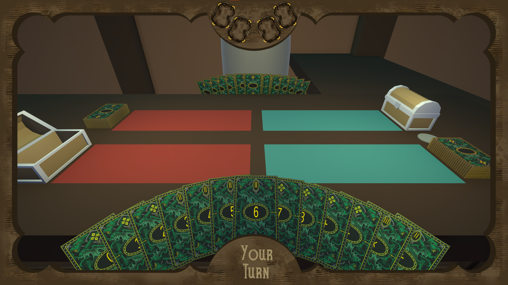

# Math Cards

**Math Cards** is a turn-based card game developed as part of an engineering thesis at Rzeszów University of Technology. The game is designed to teach and reinforce the understanding of Reverse Polish Notation (RPN) through engaging gameplay mechanics.

## Table of Contents

- [Overview](#overview)
- [Gameplay](#gameplay)
- [Features](#features)
- [Technologies Used](#technologies-used)
- [Installation](#installation)
- [Usage](#usage)
- [Project Structure](#project-structure)
- [License](#license)
- [Acknowledgements](#acknowledgements)

## Overview

The game integrates educational content with interactive gameplay, allowing players to construct mathematical expressions using cards that represent numbers and operators. The primary objective is to build valid RPN expressions to outscore the AI opponent.

## Gameplay
### Objective
The primary goal in each round is to **maximize the difference between your attack and the opponent’s defense**, and vice versa. Players build expressions using cards to create strong attacks and effective defenses.

A simplified equation used during evaluation:
```
YourAttack - OpponentDefense = OpponentAttack - YourDefense 
```
However, negative values are capped at zero — overly high defense doesn’t bring extra rewards if the opponent barely attacks.

### Cards
There are two types of cards:
- **Operands** - cards with numbers (e.g. 1,2,5)
- **Operators** - cards representing +,-,*,/

Players use these to construct expressions in RPN, such as 3 5 + to represent (3 + 5). Valid expressions are evaluated at the end of a turn or round. 

Players receive a limited number of cards:
- **51 cards total per player** per full match
- **21 cards per round**, randomized between operands and operators
- Cards played and merged are **permanently removed**, unused ones return to the pool

### Special Rule: The "0" Card
In Math Cards, the value 0 has a unique mechanic to prevent it from breaking expressions through multiplication or division:
- When the card with value 0 is placed on the table, it automatically transforms into 0.1.
- This ensures that expressions using it (e.g., multiplication or division) do not collapse to zero or cause invalid operations.
- The change happens visually and functionally during gameplay — the card still displays as “0” in hand but evaluates as 0.1 once played.
 
This subtle change keeps the gameplay fair and mathematically stable, especially in strategic combinations involving small numbers or division.

### Merge System (Card Chest)
Each player has a **merging chest**, where two numeric cards placed in consecutive turns are combined into one new card (e.g., "8" and "9" becomes "89"). This adds strategic depth, letting you save and boost powerful values.
Merging is irreversible.

### AI Opponent
The AI uses a custom behavior tree (via NodeCanvas):
- Prioritize either attack or defense
- Block your plays by interfering with your board
- Adapt strategies based on card states and board positions
- Predict your possible moves and adjust accordingly
Its logic simulates human-like behavior with a mix of predictable priorities and randomized preferences.

### Round System
The game uses a **Best of 3 (Bo3)** format:
- First to win 2 rounds wins the match
- In case of a tie in any round, both players earn a point
- If the final round is tied, the winner is chosen randomly

Progress is shown via **crystals at the top of the screen**, green for player wins and red for AI wins.

## Features

- Card-Based Gameplay: Players draw and play cards to form RPN expressions.
- AI Opponent: Compete against an AI that utilizes behavior trees for decision-making.
- Educational Focus: Reinforces understanding of RPN through practical application.
- Turn-Based Mechanics: Strategic play with a focus on planning and expression building.

## Technologies Used

- Unity Engine: Core game development platform.
- C#: Primary programming language for game logic.
- ShaderLab & HLSL: Used for custom shader development.
- NodeCanvas: Employed for AI behavior trees (Note: NodeCanvas is a paid Unity asset and is not included in this repository).

## Installation

1. Clone the Repository:
   ```git clone https://github.com/Ritomk/math-cards.git```

2. Open in Unity:
   - Use Unity Hub to open the project.
   - Ensure you have the appropriate Unity version installed.

3. Import NodeCanvas:
   - Purchase and import NodeCanvas from the Unity Asset Store.
   - This is required for the AI components to function correctly.

## Usage

After setting up the project in Unity and importing all necessary assets:

1. Build the Project:
   - Navigate to File > Build Settings in Unity.
   - Configure your build settings as desired.

2. Run the Game:
   - Press the Play button in Unity to start the game.
   - Engage in matches against the AI to practice RPN.

## Project Structure

```
math-cards/
├── Assets/                  # Contains game assets including scripts, prefabs, and shaders
├── Packages/                # Unity package configurations
├── ProjectSettings/         # Project settings and configurations
├── UIElementsSchema/        # UI schema definitions
├── .gitignore               # Specifies files to ignore in version control
├── .vsconfig                # Visual Studio configuration
└── README.md                # Project documentation
```

## License

This project is intended for educational purposes and is not licensed for commercial use. All rights reserved by the author.

## Acknowledgements

- NodeCanvas: https://assetstore.unity.com/packages/tools/visual-scripting/nodecanvas-14914
- Rzeszów University of Technology for academic support.
